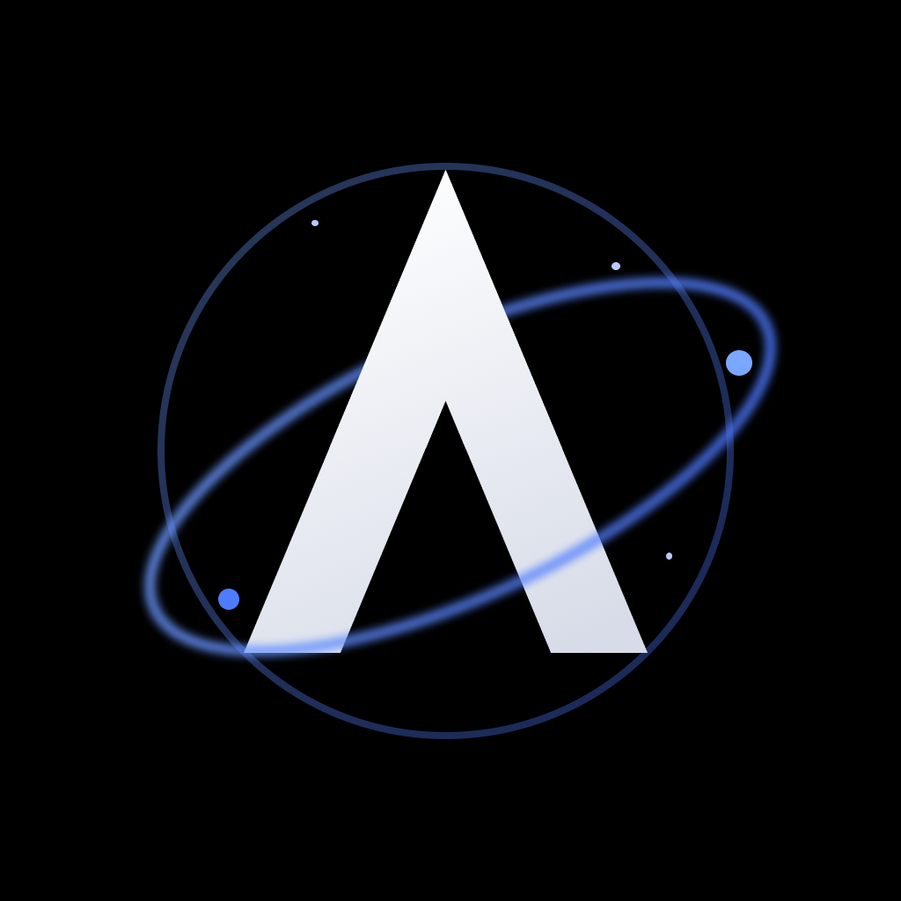

<div align="center">
  

  # Argos

  **An AI-native, multi-profile browser.**
</div>

---

Argos is a personal daily-driver browser built around three ideas: strong **profile isolation**,
**permissioned AI** that acts through auditable intents, and **secrets that never sync in plaintext**.
The repo is a production-grade monorepo spanning a native macOS app, an iOS app, an Electron desktop
build, a backend service layer, and the shared engine that ties them together.

## Platforms

| Surface | Stack | Status |
| --- | --- | --- |
| **macOS** (`apps/macos`) | Swift · SwiftUI · WebKit — Arc-style vertical tabs, Spaces, command bar | Primary, actively developed |
| **iOS** (`apps/ios`) | SwiftUI · `WKWebView` (respects Apple's engine restrictions) | In progress |
| **Desktop** (`apps/desktop`) | Electron · Chromium · React · TypeScript | In progress |
| **Backend** (`apps/backend`) | Fastify · Supabase/PostgreSQL · Redis | In progress |

The reusable browser engine lives in [`packages/BrowserCore`](packages/BrowserCore) as a Swift package;
the macOS and iOS targets only host the UI.

## Architecture

- **Profile isolation is a first-class domain boundary.** Desktop uses Electron persistent partitions
  per profile; iOS uses per-profile `WKWebsiteDataStore` and app-level metadata, because iOS cannot run
  Chromium or reliably spoof engine fingerprints.
- **AI is permissioned by workspace, profile, tab, and action type.** Browser actions are modeled as
  auditable intents, so agents can be denied, previewed, approved, replayed, and synced safely.
- **Secrets never sync in plaintext.** Local vault entries are envelope-encrypted; sync stores only
  encrypted payloads plus the metadata needed for conflict resolution.

## Quick start — macOS app

```sh
brew install xcodegen          # one-time

cd apps/macos
xcodegen generate              # regenerate the Xcode project from project.yml
open MacBrowser.xcodeproj       # select the MacBrowser scheme, ⌘R
```

Build from the CLI (full Xcode required in `/Applications/Xcode.app`):

```sh
cd apps/macos
DEVELOPER_DIR=/Applications/Xcode.app/Contents/Developer \
  xcodebuild -scheme MacBrowser -destination 'platform=macOS' build
```

See [`apps/macos/README.md`](apps/macos/README.md) for details and
[`apps/macos/SHORTCUTS.md`](apps/macos/SHORTCUTS.md) for keyboard shortcuts.

## Quick start — web / backend stack

```sh
pnpm install
pnpm build
pnpm dev:backend
pnpm dev
docker compose -f docker/docker-compose.yml up --build
```

## Repository layout

```
apps/        macos · ios · desktop · backend
packages/    BrowserCore (Swift engine) + shared TS packages
infra/       Supabase migrations and infrastructure
docs/        architecture and roadmap notes
prompts/     build prompts and design assets (incl. the Argos logo)
```

## License

Personal project. All rights reserved unless stated otherwise.
